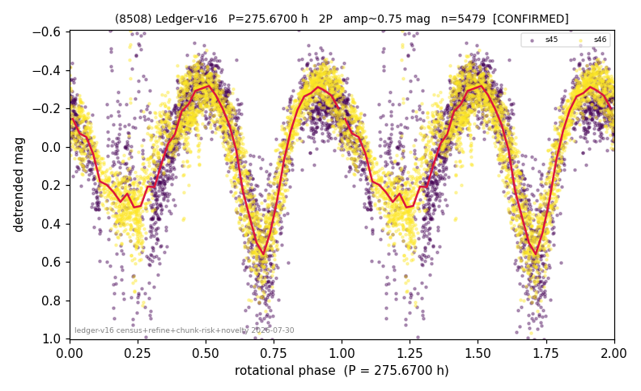

# (8508)

**Adopted:** 275.67 h, 2P, CONFIRMED

<!-- AUTO:START (regenerated from pipeline outputs; do not hand-edit this block) -->
## Evidence (auto)

Detected in 2 sector(s):

| sector | N | baseline (h) | P_phot (h) | power | FAP | cycles | flags |
|--|--|--|--|--|--|--|--|
| s45 | 2477 | 501.2 | 134.7257 | 0.3933 | 7.0e-264 | 3.7 | 2P-untestable,2P-ambiguous |
| s46 | 3032 | 623.0 | 140.945 | 0.7397 | 0.0e+00 | 2.2 | clean |

- Pipeline refine said: **2P** (folded amp_fourier 0.713); flags: few-cycle:2.3;sick-dips-excised:s45(16),s46(14)
- DIA (de-comb): **NOT RUN for this lot.** No de-comb verdict exists for this object, so momentum-dump contamination has not been excluded by that test here.
- Gates: FAP<1e-3 and power>=0.10 per detecting sector; >=2 sectors agree (harmonic-aware).
- Adopted shape: **2P** (folded-amplitude rule; pipeline agrees).

### Why this row reads the way it does

- 2 sector(s) detecting
- cross-sector fold correlation 0.89
- doubling BY CONVENTION: amplitude rule on folded amp 0.713 mag, not individually audited
- pipeline flag: few-cycle

<!-- AUTO:END -->
