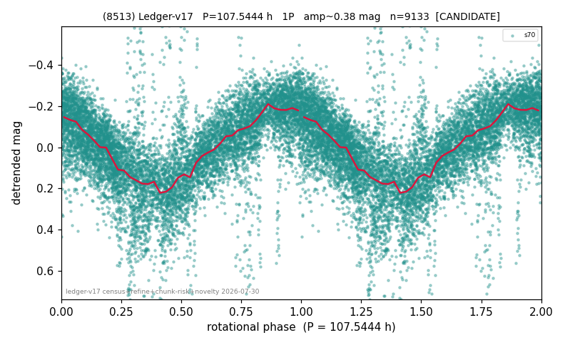

# (8513)

**Adopted:** 107.5444 h, 1P, CANDIDATE

<!-- AUTO:START (regenerated from pipeline outputs; do not hand-edit this block) -->
## Evidence (auto)

Detected in 1 sector(s):

| sector | N | baseline (h) | P_phot (h) | power | FAP | cycles | flags |
|--|--|--|--|--|--|--|--|
| s70 | 9282 | 600.2 | 107.5444 | 0.503 | 0.0e+00 | 5.6 | star-cleaned:32,2P-ambiguous |

- Pipeline refine said: **1P** (folded amp_fourier 0.379); flags: near-comb(amp-cleared):n=3;few-cycle:2.8;sick-dips-excised:s70(104);near-threshold:0.38
- DIA (de-comb): survived(dPW=-10%,R2=0.06,s70@107.544h,3sec)
- Coverage: **1 sector(s)**, best sector covers **5.58 cycles** of the adopted period. Measured periodogram peak width 15% of the period, i.e. about **+/- 6.91 h** (1 sigma); the decimal places in the adopted value are not a precision claim.
- Factor of two: no doubling was applied.
- Gates: FAP<1e-3 and power>=0.10 per detecting sector; single strong sector (candidate ceiling).
- Adopted shape: **1P** (folded-amplitude rule; pipeline agrees).

### Why this row reads the way it does

- 1 sector(s) detecting
- single-peaked at folded amp 0.379 mag
- CHUNK QUARANTINE (SUPPRESSED): the adopted period is at least half the extraction chunk span, and median-matching the chunks removes variation slower than one chunk. Needs a direct re-extraction before this period can be claimed
- pipeline flag: few-cycle
- CHUNK QUARANTINE LIFTED by direct re-extraction 2026-08-05: the sector(s) were re-extracted without chunking and the power at the adopted period is retained or improved (s70 power 0.274->0.342). The stitching filter was not creating this period.

<!-- AUTO:END -->
