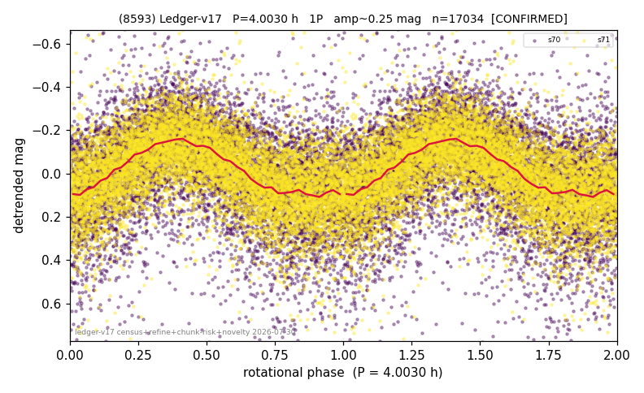

# (8593)

**Adopted:** 8.006 h, 2P, CONFIRMED

<!-- AUTO:START (regenerated from pipeline outputs; do not hand-edit this block) -->
## Evidence (auto)

Detected in 2 sector(s):

| sector | N | baseline (h) | P_phot (h) | power | FAP | cycles | flags |
|--|--|--|--|--|--|--|--|
| s70 | 8009 | 600.9 | 4.0038 | 0.1983 | 0.0e+00 | 150.1 | star-cleaned:201,2P-ambiguous |
| s71 | 9049 | 607.9 | 4.0027 | 0.3095 | 0.0e+00 | 151.9 | star-cleaned:71,2P-ambiguous |

- Pipeline refine said: **1P** (folded amp_fourier 0.287); flags: sick-dips-excised:s70(13),s71(7)
- DIA (de-comb): survived_v2(ret=1.000[1.00-1.00],s71@4.003h)
- Coverage: **2 sector(s)**, best sector covers **151.86 cycles** of the adopted period. Measured periodogram peak width 1% of the period, i.e. about **+/- 0.009819 h** (1 sigma); the decimal places in the adopted value are not a precision claim.
- Factor of two: no doubling was applied.
- Gates: FAP<1e-3 and power>=0.10 per detecting sector; >=2 sectors agree (harmonic-aware).
- **Adopted shape 2P OVERRIDES the pipeline's 1P** (doubling audit 2026-07-25: folded amplitude >= 0.25 mag, so a single-peaked curve is physically implausible; Harris convention -> 2P. The census 3-test doubling logic was measured at only 30% recall against 289 LCDB U>=2 ground-truth periods).

### Why this row reads the way it does

- 2 sector(s) detecting
- cross-sector fold correlation 0.96
- single-peaked at folded amp 0.287 mag
- SHAPE AMBIGUOUS (adversarial review 2026-08-16): calibrated odd-harmonic z = 3.1/9.2, directional evidence for 2P but below the declared >=8-sigma-reproduced bar; A_fit is in the 0.25-0.40 ambiguous band. Published as 1P with P/2 -> 2P possible; must NOT be counted as a short-period rotator in any statistic
- DOUBLING CORRECTED 2026-08-30: adopted period doubled from 4.003 h. The previous value came from the folded-amplitude rule, which was found biased low (9 of 9 disagreements with MPB 2024-2026 in the same direction). Odd-harmonic test at the long period gives z1=6.8 with margin 5.36 over non-harmonic multiples 1.7x/2.3x (reference group: 0 of 38 above margin 2).

<!-- AUTO:END -->
