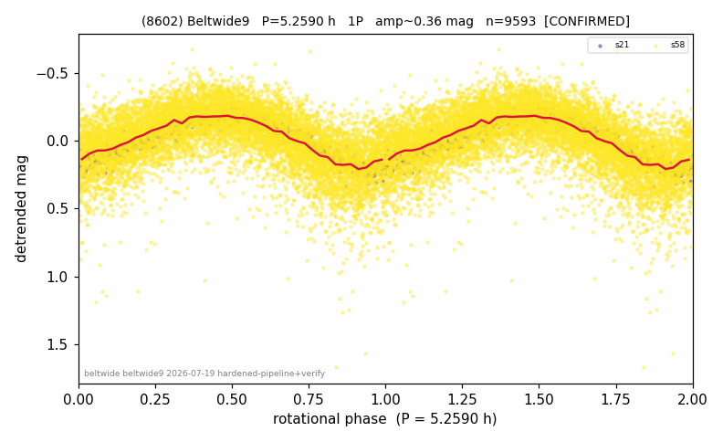

# (8602)

**Adopted:** 5.259 h, 1P, CONFIRMED

<!-- AUTO:START (regenerated from pipeline outputs; do not hand-edit this block) -->
## Evidence (auto)

Detected in 2 sector(s):

| sector | N | baseline (h) | P_phot (h) | power | FAP | cycles | flags |
|--|--|--|--|--|--|--|--|
| s21 | 579 | 433.5 | 5.2579 | 0.9094 | 3.6e-296 | 82.4 | 2P-ambiguous |
| s58 | 9014 | 614.3 | 5.2594 | 0.3844 | 0.0e+00 | 116.8 | 2P-ambiguous |

- Refined shape: **1P** (folded amp_fourier 0.381); flags: sick-dips-excised:s58(7);near-threshold:0.38
- DIA (de-comb): survived(dPW=+1%,R2=0.14,s21@5.259h,3sec)
- Gates: FAP<1e-3 and power>=0.10 per detecting sector; >=2 sectors agree (harmonic-aware); folded-amplitude rule -> 1P.

<!-- AUTO:END -->
