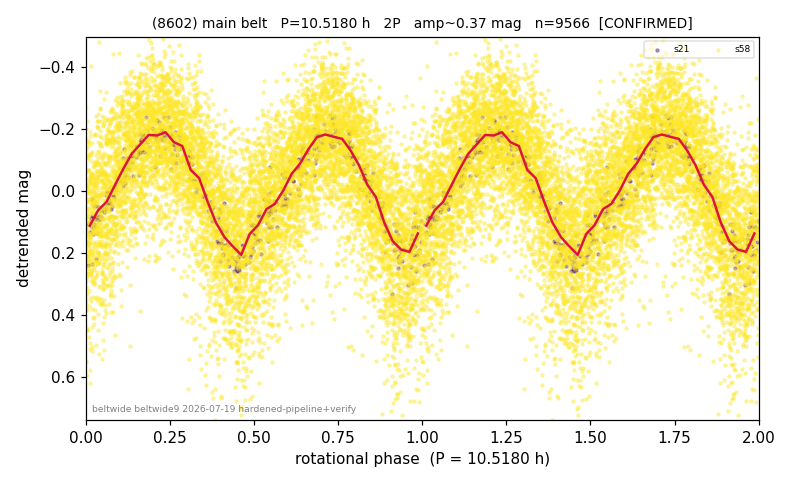

# (8602)

**Adopted:** 10.518 h, 2P, CONFIRMED

<!-- AUTO:START (regenerated from pipeline outputs; do not hand-edit this block) -->
## Evidence (auto)

Detected in 2 sector(s):

| sector | N | baseline (h) | P_phot (h) | power | FAP | cycles | flags |
|--|--|--|--|--|--|--|--|
| s21 | 579 | 433.5 | 5.2579 | 0.9094 | 3.6e-296 | 82.4 | 2P-ambiguous |
| s58 | 9014 | 614.3 | 5.2594 | 0.3844 | 0.0e+00 | 116.8 | 2P-ambiguous |

- Pipeline refine said: **1P** (folded amp_fourier 0.371); flags: amp-from-clean-sectors(ignored s58);sick-dips-excised:s58(7);near-threshold:0.37
- DIA (de-comb): survived(dPW=+1%,R2=0.14,s21@5.259h,3sec)
- Gates: FAP<1e-3 and power>=0.10 per detecting sector; >=2 sectors agree (harmonic-aware).
- **Adopted shape 2P OVERRIDES the pipeline's 1P** (doubling audit 2026-07-25: folded amplitude >= 0.25 mag, so a single-peaked curve is physically implausible; Harris convention -> 2P. The census 3-test doubling logic was measured at only 30% recall against 289 LCDB U>=2 ground-truth periods).

### Why this row reads the way it does

- folded_amp=0.37. s21+s58 agree 0.03% (FAP 1e-296/~0); combined fold single-lobed; 2P test rejected in both sectors. REVIEW-FLAG: amp rides the 0.40 line (0.34-0.41 by binning) - recheck if a new sector lands.; P doubled 2026-07-25 (doubling audit: amp>=0.25 + Harris convention)

<!-- AUTO:END -->
