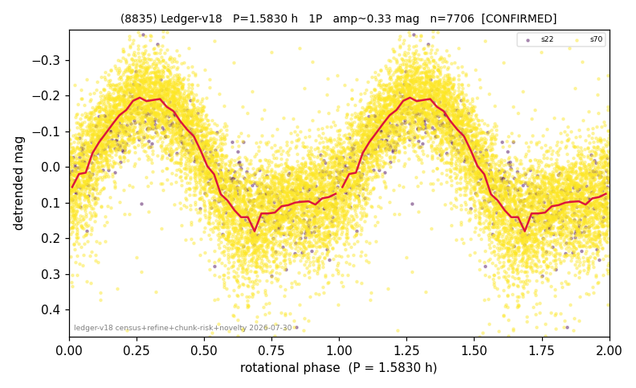

# (8835)

**Adopted:** 1.583 h, 1P, CONFIRMED

<!-- AUTO:START (regenerated from pipeline outputs; do not hand-edit this block) -->
## Evidence (auto)

Detected in 2 sector(s):

| sector | N | baseline (h) | P_phot (h) | power | FAP | cycles | flags |
|--|--|--|--|--|--|--|--|
| s22 | 526 | 315.5 | 1.5833 | 0.7299 | 7.5e-145 | 199.3 | 2P-ambiguous |
| s70 | 7213 | 539.7 | 1.5827 | 0.6601 | 0.0e+00 | 170.5 | star-cleaned:57 |

- Pipeline refine said: **1P** (folded amp_fourier 0.367); flags: sick-dips-excised:s70(23);near-threshold:0.37
- DIA (de-comb): not triggered (clean, fast, non-comb)
- Gates: FAP<1e-3 and power>=0.10 per detecting sector; >=2 sectors agree (harmonic-aware).
- Adopted shape: **1P** (folded-amplitude rule; pipeline agrees).

### Why this row reads the way it does

- 2 sector(s) detecting
- cross-sector fold correlation 0.91
- single-peaked at folded amp 0.367 mag

<!-- AUTO:END -->
