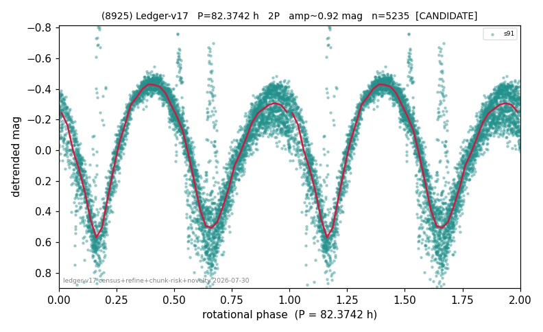

# (8925)

**Adopted:** 82.3742 h, 2P, CANDIDATE

<!-- AUTO:START (regenerated from pipeline outputs; do not hand-edit this block) -->
## Evidence (auto)

Detected in 1 sector(s):

| sector | N | baseline (h) | P_phot (h) | power | FAP | cycles | flags |
|--|--|--|--|--|--|--|--|
| s91 | 5266 | 511.9 | 41.1871 | 0.75 | 0.0e+00 | 6.2 | star-cleaned:53 |

- Pipeline refine said: **2P** (folded amp_fourier 0.912); flags: near-comb(amp-cleared):n=4,8;gap-alias-risk:154h;sick-dips-excised:s91(31)
- DIA (de-comb): survived_v2(ret=0.984[0.96-1.00],s91@41.187h)
- Coverage: **1 sector(s)**, best sector covers **6.21 cycles** of the adopted period. Measured periodogram peak width 13% of the period, i.e. about **+/- 2.241 h** (1 sigma); the decimal places in the adopted value are not a precision claim.
- Factor of two: **adopted on the amplitude convention**: standard practice for an elongated body, but a convention rather than a measurement.
- Gates: FAP<1e-3 and power>=0.10 per detecting sector; single strong sector (candidate ceiling).
- Adopted shape: **2P** (folded-amplitude rule; pipeline agrees).

### Why this row reads the way it does

- 1 sector(s) detecting
- doubling BY CONVENTION: amplitude rule on folded amp 0.912 mag, not individually audited

<!-- AUTO:END -->
