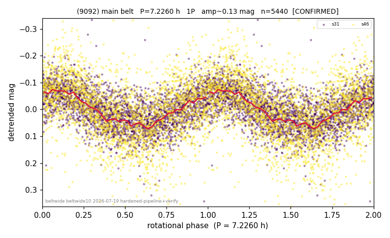

# (9092)

**Adopted:** 7.226 h, 1P, CONFIRMED

<!-- AUTO:START (regenerated from pipeline outputs; do not hand-edit this block) -->
## Evidence (auto)

Detected in 2 sector(s):

| sector | N | baseline (h) | P_phot (h) | power | FAP | cycles | flags |
|--|--|--|--|--|--|--|--|
| s31 | 2721 | 610.2 | 7.2251 | 0.3184 | 1.2e-221 | 84.5 | star-cleaned:4,2P-ambiguous |
| s46 | 2750 | 630.4 | 7.2273 | 0.1612 | 1.4e-100 | 87.2 | star-cleaned:17,2P-ambiguous |

- Refined shape: **1P** (folded amp_fourier 0.137); flags: sector-dropped:s46(range>3mag)
- DIA (de-comb): survived(dPW=+2%,R2=0.29,s31@7.226h,3sec)
- Gates: FAP<1e-3 and power>=0.10 per detecting sector; >=2 sectors agree (harmonic-aware); folded-amplitude rule -> 1P.

<!-- AUTO:END -->
