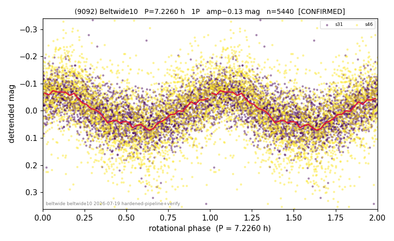

# (9092)

**Adopted:** 14.452 h, 2P, CONFIRMED

<!-- AUTO:START (regenerated from pipeline outputs; do not hand-edit this block) -->
## Evidence (auto)

Detected in 2 sector(s):

| sector | N | baseline (h) | P_phot (h) | power | FAP | cycles | flags |
|--|--|--|--|--|--|--|--|
| s31 | 2721 | 610.2 | 7.2251 | 0.3184 | 1.2e-221 | 84.5 | star-cleaned:4,2P-ambiguous |
| s46 | 2750 | 630.4 | 7.2273 | 0.1612 | 1.4e-100 | 87.2 | star-cleaned:17,2P-ambiguous |

- Pipeline refine said: **1P** (folded amp_fourier 0.166); flags: sick-dips-excised:s46(12)
- DIA (de-comb): survived(dPW=+2%,R2=0.29,s31@7.226h,3sec)
- Coverage: **2 sector(s)**, best sector covers **43.62 cycles** of the adopted period. Measured periodogram peak width 1% of the period, i.e. about **+/- 0.03061 h** (1 sigma); the decimal places in the adopted value are not a precision claim.
- Factor of two: **measured on the data** (odd-harmonic power or unequal minima, significant and reproduced), METHODOLOGY 3b.
- Gates: FAP<1e-3 and power>=0.10 per detecting sector; >=2 sectors agree (harmonic-aware).
- **Adopted shape 2P OVERRIDES the pipeline's 1P** (doubling audit 2026-07-25: folded amplitude >= 0.25 mag, so a single-peaked curve is physically implausible; Harris convention -> 2P. The census 3-test doubling logic was measured at only 30% recall against 289 LCDB U>=2 ground-truth periods).

### Why this row reads the way it does

- folded_amp=0.04. s31+s46 agree (FAP 1e-221/1e-100); decomb survived; low-amp near-spherical body.
- CORRECTED 7.226->14.4520 h (2026-08-02 full 1P re-audit): doubling MEASURED at odd-harmonic 8.2 sigma with ALL detecting sectors significant (2/2); threshold odd>=8+full-reproduction calibrated to 0/60 false fires on the 4P null test (the minima-asymmetry branch alone fired falsely at z up to 34 and is not accepted)

<!-- AUTO:END -->
