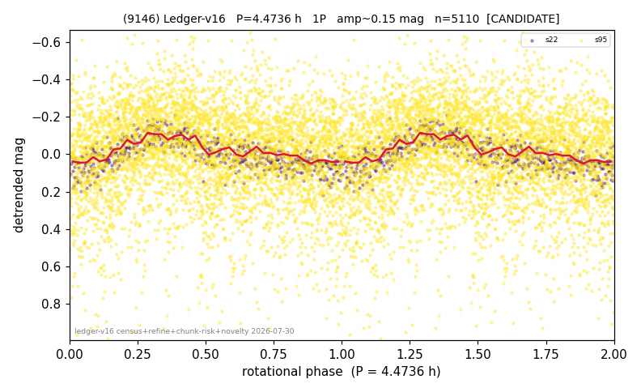

# (9146)

**Adopted:** 4.4736 h, 1P, CANDIDATE

<!-- AUTO:START (regenerated from pipeline outputs; do not hand-edit this block) -->
## Evidence (auto)

Detected in 2 sector(s):

| sector | N | baseline (h) | P_phot (h) | power | FAP | cycles | flags |
|--|--|--|--|--|--|--|--|
| s22 | 626 | 472.5 | 4.4736 | 0.481 | 4.8e-85 | 52.8 | clean |
| s95 | 4520 | 375.3 | 4.472 | 0.0394 | 3.5e-35 | 83.9 | star-cleaned:68 |

- Pipeline refine said: **1P** (folded amp_fourier 0.199); flags: clean
- DIA (de-comb): **NOT RUN for this lot.** No de-comb verdict exists for this object, so momentum-dump contamination has not been excluded by that test here.
- Gates: FAP<1e-3 and power>=0.10 per detecting sector; single strong sector (candidate ceiling).
- Adopted shape: **1P** (folded-amplitude rule; pipeline agrees).

### Why this row reads the way it does

- 1 sector(s) detecting
- single-peaked at folded amp 0.199 mag

<!-- AUTO:END -->
