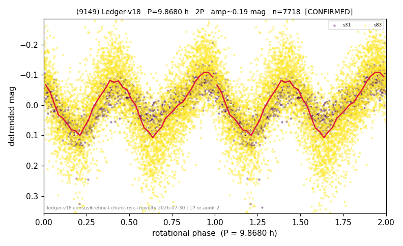

# (9149)

**Adopted:** 9.868 h, 2P, CONFIRMED

<!-- AUTO:START (regenerated from pipeline outputs; do not hand-edit this block) -->
## Evidence (auto)

Detected in 2 sector(s):

| sector | N | baseline (h) | P_phot (h) | power | FAP | cycles | flags |
|--|--|--|--|--|--|--|--|
| s31 | 1427 | 371.2 | 4.9332 | 0.5911 | 3.4e-272 | 75.2 | 2P-ambiguous |
| s83 | 6294 | 436.2 | 4.9351 | 0.4339 | 0.0e+00 | 88.4 | star-cleaned:9,2P-ambiguous |

- Pipeline refine said: **1P** (folded amp_fourier 0.237); flags: clean
- DIA (de-comb): not triggered (clean, fast, non-comb)
- Gates: FAP<1e-3 and power>=0.10 per detecting sector; >=2 sectors agree (harmonic-aware).
- **Adopted shape 2P OVERRIDES the pipeline's 1P** (doubling audit 2026-07-25: folded amplitude >= 0.25 mag, so a single-peaked curve is physically implausible; Harris convention -> 2P. The census 3-test doubling logic was measured at only 30% recall against 289 LCDB U>=2 ground-truth periods).

### Why this row reads the way it does

- 2 sector(s) detecting
- cross-sector fold correlation 0.90
- single-peaked at folded amp 0.237 mag
- CORRECTED 4.934->9.8680 h (2026-08-02 full 1P re-audit): doubling MEASURED at odd-harmonic 12.9 sigma with ALL detecting sectors significant (2/2); threshold odd>=8+full-reproduction calibrated to 0/60 false fires on the 4P null test (the minima-asymmetry branch alone fired falsely at z up to 34 and is not accepted)

<!-- AUTO:END -->
