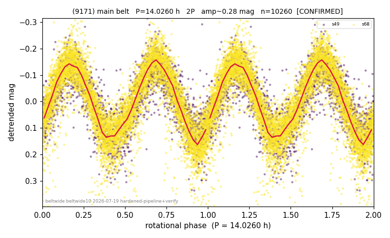

# (9171)

**Adopted:** 14.026 h, 2P, CONFIRMED

<!-- AUTO:START (regenerated from pipeline outputs; do not hand-edit this block) -->
## Evidence (auto)

Detected in 2 sector(s):

| sector | N | baseline (h) | P_phot (h) | power | FAP | cycles | flags |
|--|--|--|--|--|--|--|--|
| s49 | 2188 | 573.7 | 7.0142 | 0.6327 | 0.0e+00 | 81.8 | star-cleaned:8,2P-ambiguous |
| s68 | 8098 | 602.9 | 7.0115 | 0.7205 | 0.0e+00 | 86.0 | star-cleaned:11,2P-ambiguous |

- Pipeline refine said: **1P** (folded amp_fourier 0.313); flags: sick-dips-excised:s49(4),s68(5)
- DIA (de-comb): survived(dPW=-0%,R2=0.00,s68@7.013h,2sec)
- Gates: FAP<1e-3 and power>=0.10 per detecting sector; >=2 sectors agree (harmonic-aware).
- **Adopted shape 2P OVERRIDES the pipeline's 1P** (doubling audit 2026-07-25: folded amplitude >= 0.25 mag, so a single-peaked curve is physically implausible; Harris convention -> 2P. The census 3-test doubling logic was measured at only 30% recall against 289 LCDB U>=2 ground-truth periods).

<!-- AUTO:END -->
