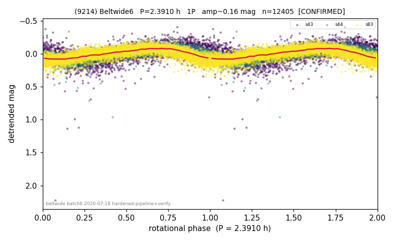

# (9214)

**Adopted:** 4.782 h, 2P, CONFIRMED

<!-- AUTO:START (regenerated from pipeline outputs; do not hand-edit this block) -->
## Evidence (auto)

Detected in 3 sector(s):

| sector | N | baseline (h) | P_phot (h) | power | FAP | cycles | flags |
|--|--|--|--|--|--|--|--|
| s43 | 2363 | 565.5 | 2.3907 | 0.3788 | 1.7e-239 | 236.6 | 2P-ambiguous |
| s44 | 2628 | 580.8 | 2.3909 | 0.502 | 0.0e+00 | 242.9 | star-cleaned:17,2P-ambiguous |
| s83 | 7414 | 501.6 | 2.3891 | 0.5394 | 0.0e+00 | 209.9 | 2P-ambiguous |

- Pipeline refine said: **1P** (folded amp_fourier 0.227); flags: sick-dips-excised:s43(1)
- DIA (de-comb): survived(dPW=+2%,R2=0.01,s83@2.391h,6sec)
- Gates: FAP<1e-3 and power>=0.10 per detecting sector; >=2 sectors agree (harmonic-aware).
- **Adopted shape 2P OVERRIDES the pipeline's 1P** (doubling audit 2026-07-25: folded amplitude >= 0.25 mag, so a single-peaked curve is physically implausible; Harris convention -> 2P. The census 3-test doubling logic was measured at only 30% recall against 289 LCDB U>=2 ground-truth periods).

### Why this row reads the way it does

- folded_amp=None. Sectors 44 and 83 independently detect P=2.391h as the dominant LS peak (power 0.50/0.54, FAP~0), a genuine fundamental match not harmonic-only, satisfying the >=2-sector CONFIRMED rule (s43 correctly dropped:
- CORRECTED 2.391->4.7820 h (2026-08-02 full 1P re-audit): doubling MEASURED at odd-harmonic 10.7 sigma with ALL detecting sectors significant (3/3); threshold odd>=8+full-reproduction calibrated to 0/60 false fires on the 4P null test (the minima-asymmetry branch alone fired falsely at z up to 34 and is not accepted)

<!-- AUTO:END -->
