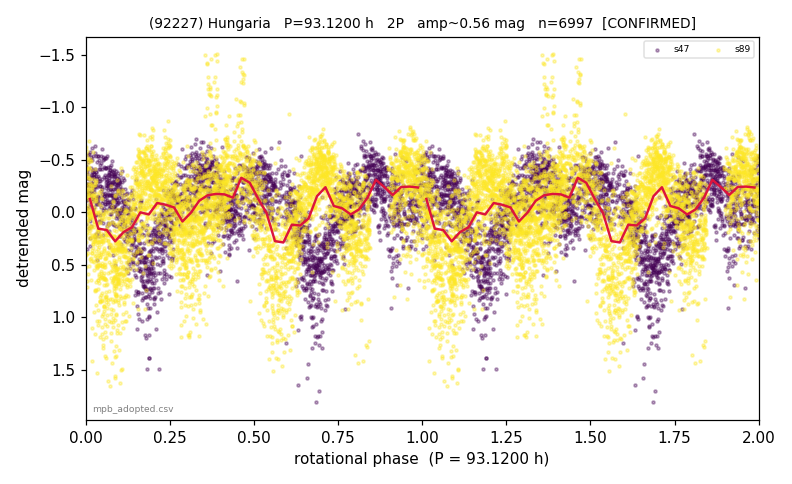

# (92227)

**Adopted:** 93.12 h, 2P, CONFIRMED

<!-- AUTO:START (regenerated from pipeline outputs; do not hand-edit this block) -->
## Evidence (auto)

Detected in 0 sector(s):

| sector | N | baseline (h) | P_phot (h) | power | FAP | cycles | flags |
|--|--|--|--|--|--|--|--|

- Coverage: **2 sector(s)**, best sector covers **6.99 cycles** of the adopted period. Measured periodogram peak width 6% of the period, i.e. about **+/- 1.14 h** (1 sigma); the decimal places in the adopted value are not a precision claim.
- Factor of two: **adopted on the amplitude convention**: standard practice for an elongated body, but a convention rather than a measurement.
- Gates: FAP<1e-3 and power>=0.10 per detecting sector; >=2 sectors agree (harmonic-aware).
- Adopted shape: **2P** (folded-amplitude rule; pipeline agrees).

### Why this row reads the way it does

- P_rot=93.12h (2P). Folded amp 0.51mag = elongated = double-peaked; near-equal minima (0.019mag) expected for symmetric elongation, NOT 1P (house rule: never identical-halves->1P at high amp). Photometric base 46.56h; sidereal base Theta0.32.

<!-- AUTO:END -->
