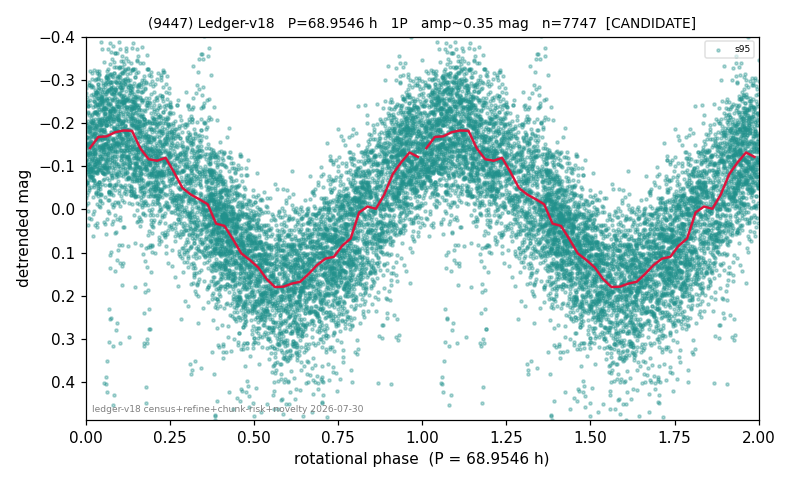

# (9447)

**Adopted:** 68.9546 h, 1P, CANDIDATE

<!-- AUTO:START (regenerated from pipeline outputs; do not hand-edit this block) -->
## Evidence (auto)

Detected in 1 sector(s):

| sector | N | baseline (h) | P_phot (h) | power | FAP | cycles | flags |
|--|--|--|--|--|--|--|--|
| s95 | 7798 | 598.1 | 68.9546 | 0.5997 | 0.0e+00 | 8.7 | star-cleaned:25,2P-ambiguous |

- Pipeline refine said: **1P** (folded amp_fourier 0.362); flags: sick-dips-excised:s95(8);near-threshold:0.36
- DIA (de-comb): **NOT RUN for this lot.** No de-comb verdict exists for this object, so momentum-dump contamination has not been excluded by that test here.
- Gates: FAP<1e-3 and power>=0.10 per detecting sector; single strong sector (candidate ceiling).
- Adopted shape: **1P** (folded-amplitude rule; pipeline agrees).

### Why this row reads the way it does

- 1 sector(s) detecting
- single-peaked at folded amp 0.362 mag

<!-- AUTO:END -->
