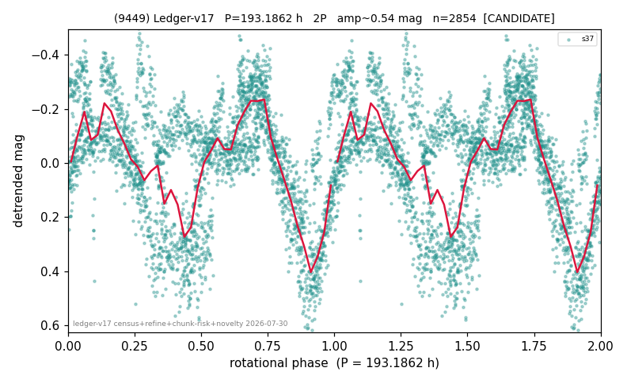

# (9449)

**Adopted:** 193.1862 h, 2P, CANDIDATE

<!-- AUTO:START (regenerated from pipeline outputs; do not hand-edit this block) -->
## Evidence (auto)

Detected in 1 sector(s):

| sector | N | baseline (h) | P_phot (h) | power | FAP | cycles | flags |
|--|--|--|--|--|--|--|--|
| s37 | 2855 | 602.5 | 96.5931 | 0.3319 | 3.1e-245 | 6.2 | 2P-ambiguous |

- Pipeline refine said: **2P** (folded amp_fourier 0.423); flags: few-cycle:3.1;sick-dips-excised:s37(1);near-threshold:0.42
- DIA (de-comb): not triggered (clean, fast, non-comb)
- Gates: FAP<1e-3 and power>=0.10 per detecting sector; single strong sector (candidate ceiling).
- Adopted shape: **2P** (folded-amplitude rule; pipeline agrees).

### Why this row reads the way it does

- 1 sector(s) detecting
- doubling MEASURED: unequal minima at 193.19 h (z=4.5); odd-harmonic term not significant
- pipeline flag: few-cycle

<!-- AUTO:END -->
