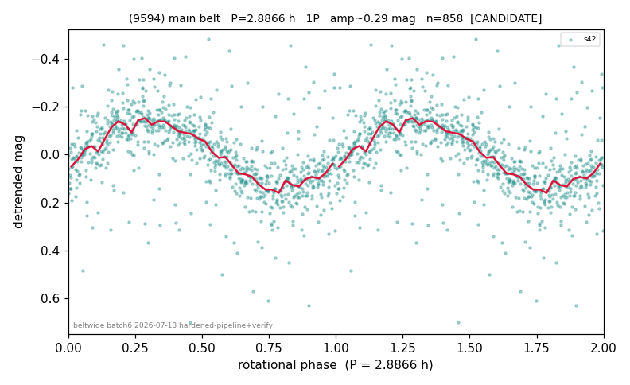

# (9594)

**Adopted:** 2.8866 h, 1P, CANDIDATE

<!-- AUTO:START (regenerated from pipeline outputs; do not hand-edit this block) -->
## Evidence (auto)

Detected in 1 sector(s):

| sector | N | baseline (h) | P_phot (h) | power | FAP | cycles | flags |
|--|--|--|--|--|--|--|--|
| s42 | 864 | 331.8 | 2.8866 | 0.452 | 1.4e-108 | 115.0 | star-cleaned:11,2P-ambiguous |

- Pipeline refine said: **1P** (folded amp_fourier 0.3); flags: sick-dips-excised:s42(6)
- DIA (de-comb): survived(dPW=-2%,R2=0.18,s42@2.887h,1sec)
- Gates: FAP<1e-3 and power>=0.10 per detecting sector; single strong sector (candidate ceiling).
- Adopted shape: **1P** (folded-amplitude rule; pipeline agrees).

### Why this row reads the way it does

- folded_amp=0.31. Single sector (s42) only, so CONFIRMED tier is barred by house rule regardless of signal quality; LS gives P=2.8866h with power=0.452, FAP=1.4e-108, no power at 2x/0.5x harmonics, and window-function power at t

<!-- AUTO:END -->
