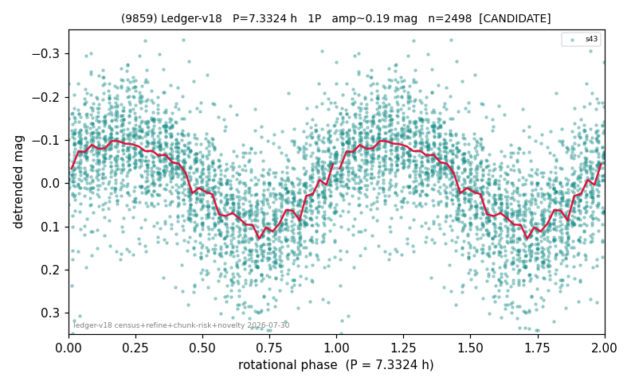

# (9859)

**Adopted:** 7.3324 h, 1P, CONFIRMED

<!-- AUTO:START (regenerated from pipeline outputs; do not hand-edit this block) -->
## Evidence (auto)

Detected in 1 sector(s):

| sector | N | baseline (h) | P_phot (h) | power | FAP | cycles | flags |
|--|--|--|--|--|--|--|--|
| s43 | 2520 | 569.0 | 7.3324 | 0.3698 | 8.4e-248 | 77.6 | star-cleaned:12,2P-ambiguous |

- Pipeline refine said: **1P** (folded amp_fourier 0.212); flags: sick-dips-excised:s43(6)
- DIA (de-comb): survived(dPW=+9%,R2=0.49,s43@7.332h,1sec)
- Coverage: **1 sector(s)**, best sector covers **77.6 cycles** of the adopted period. Measured periodogram peak width 1% of the period, i.e. about **+/- 0.0327 h** (1 sigma); the decimal places in the adopted value are not a precision claim.
- Factor of two: no doubling was applied.
- Gates: FAP<1e-3 and power>=0.10 per detecting sector; >=2 sectors agree (harmonic-aware).
- Adopted shape: **1P** (folded-amplitude rule; pipeline agrees).

### Why this row reads the way it does

- 1 sector(s) detecting
- single-peaked at folded amp 0.212 mag
- PROMOTED CANDIDATE->CONFIRMED 2026-08-15 (TESS+ZTF joint, the user-blessed pathway): independent ZTF blind Lomb-Scargle over 6.1 yr / 387 g+r points recovers 7.3334 h = TESS-P 7.3324h to 0.01%, power 0.503, trials-corrected FAP 2.4e-53, beating every alias/comb candidate (comb n=45 7.307h at 0.498); a ZTF detection cannot be a TESS comb tooth or TESS red noise, so this is a genuine second realization and the single-sector ceiling no longer applies

<!-- AUTO:END -->
