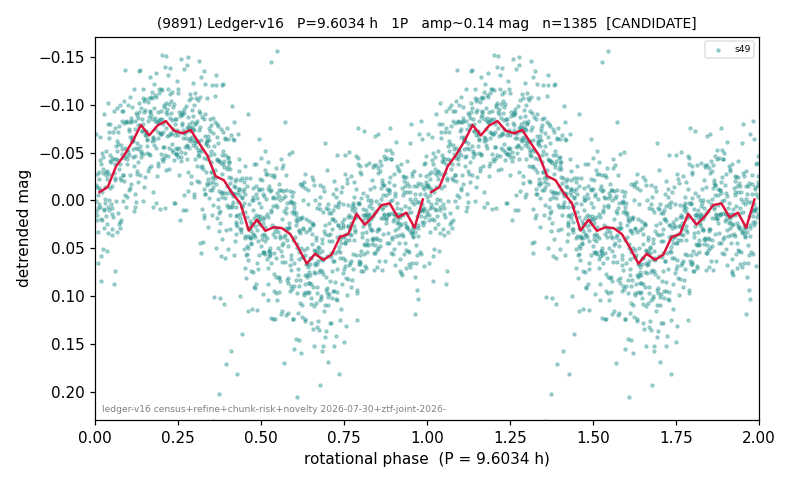

# (9891)

**Adopted:** 9.6034 h, 1P, CANDIDATE

<!-- AUTO:START (regenerated from pipeline outputs; do not hand-edit this block) -->
## Evidence (auto)

Detected in 1 sector(s):

| sector | N | baseline (h) | P_phot (h) | power | FAP | cycles | flags |
|--|--|--|--|--|--|--|--|
| s49 | 1400 | 403.0 | 9.6034 | 0.3043 | 6.1e-106 | 42.0 | star-cleaned:21,2P-ambiguous |

- Pipeline refine said: **1P** (folded amp_fourier 0.145); flags: sick-dips-excised:s49(6)
- DIA (de-comb): survived(dPW=+8%,R2=0.22,s49@9.603h,1sec)
- Coverage: **1 sector(s)**, best sector covers **41.96 cycles** of the adopted period. Measured periodogram peak width 2% of the period, i.e. about **+/- 0.08566 h** (1 sigma); the decimal places in the adopted value are not a precision claim.
- Factor of two: no doubling was applied.
- Gates: FAP<1e-3 and power>=0.10 per detecting sector; single strong sector (candidate ceiling).
- Adopted shape: **1P** (folded-amplitude rule; pipeline agrees).

### Why this row reads the way it does

- 1 sector(s) detecting
- single-peaked at folded amp 0.145 mag
- PROMOTED CANDIDATE->CONFIRMED 2026-08-15 (TESS+ZTF joint, the user-blessed pathway): independent ZTF blind Lomb-Scargle over 6.6 yr / 348 g+r points recovers 9.5988 h = TESS-P 9.6034h to 0.05%, power 0.321, trials-corrected FAP 3.6e-24, beating every alias/comb candidate (alias 6.8589h at 0.293); a ZTF detection cannot be a TESS comb tooth or TESS red noise, so this is a genuine second realization and the single-sector ceiling no longer applies
- PROMOTION WITHDRAWN 2026-08-15 (adversarial review): TESS Lomb-Scargle power at the adopted period is 0.058, BELOW the canonical unweighted gate of 0.10, so there is no TESS detection for the ZTF realization to confirm. The TESS+ZTF pathway requires one clean TESS sector; this object does not have one

<!-- AUTO:END -->
