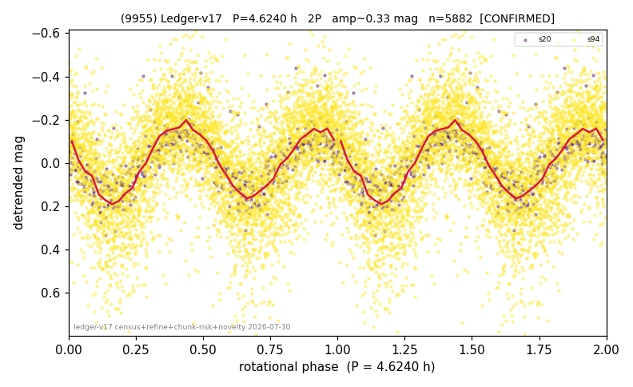

# (9955)

**Adopted:** 2.312 h, 1P, CONFIRMED

<!-- AUTO:START (regenerated from pipeline outputs; do not hand-edit this block) -->
## Evidence (auto)

Detected in 2 sector(s):

| sector | N | baseline (h) | P_phot (h) | power | FAP | cycles | flags |
|--|--|--|--|--|--|--|--|
| s20 | 616 | 468.0 | 2.3118 | 0.5545 | 7.4e-104 | 202.4 | 2P-ambiguous |
| s94 | 5299 | 434.6 | 2.3129 | 0.3329 | 0.0e+00 | 187.9 | star-cleaned:2,2P-ambiguous |

- Pipeline refine said: **1P** (folded amp_fourier 0.288); flags: amp-from-clean-sectors(ignored s94);sick-dips-excised:s94(15)
- DIA (de-comb): survived(dPW=+1%,R2=0.27,s20@2.312h,2sec)
- Coverage: **2 sector(s)**, best sector covers **202.43 cycles** of the adopted period. Measured periodogram peak width 0% of the period, i.e. about **+/- 0.00464 h** (1 sigma); the decimal places in the adopted value are not a precision claim.
- Factor of two: no doubling was applied.
- Gates: FAP<1e-3 and power>=0.10 per detecting sector; >=2 sectors agree (harmonic-aware).
- Adopted shape: **1P** (folded-amplitude rule; pipeline agrees).

### Why this row reads the way it does

- 2 sector(s) detecting
- cross-sector fold correlation 0.97
- single-peaked at folded amp 0.288 mag

<!-- AUTO:END -->
